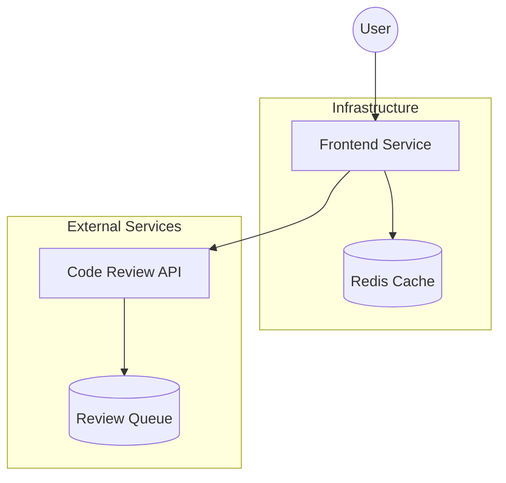
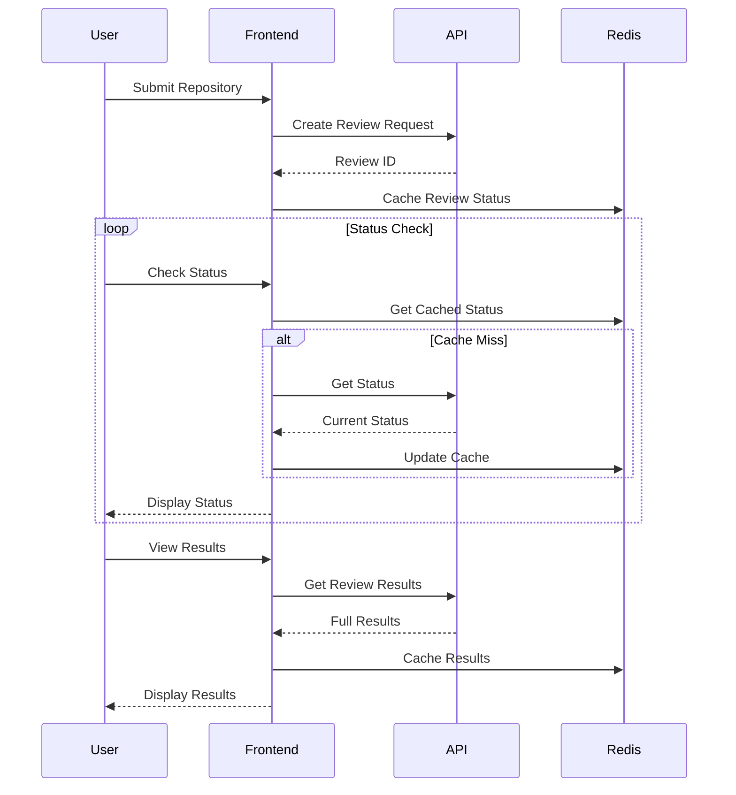
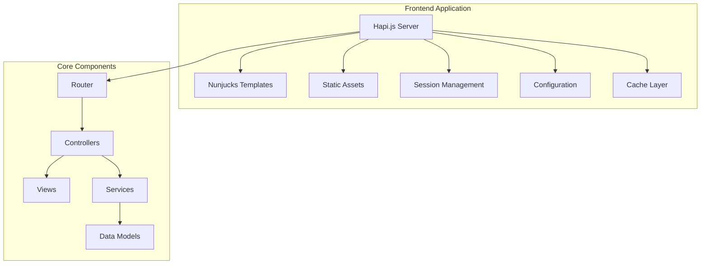
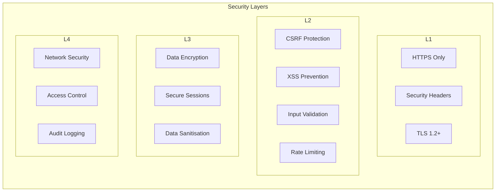
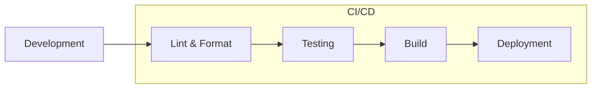

# Architecture Overview

This document outlines the architecture of the Defra AI Code Review Frontend application.

## System Context

The application is a web-based frontend service that provides an interface for AI-powered code reviews. It integrates with a separate backend API service for processing code review requests.

## Data Flow

## Component Architecture

## Technology Stack

### Frontend Framework

- **Server**: Node.js with Hapi.js
- **Templates**: Nunjucks
- **Styling**: SCSS with GOV.UK Frontend
- **Build Tools**: Webpack + Babel

### State Management

- **Session Management**: Redis (Production) / Memory (Development)
- **Configuration**: Convict
- **Cache Layer**: Catbox with Redis/Memory providers

### Development Tools

- **Type Checking**: TypeScript
- **Testing**: Jest
- **Linting**: ESLint + Prettier
- **Style Linting**: Stylelint

## Key Components

### Server

- Hapi.js server with plugins for:
  - Static file serving
  - Security headers
  - Session management
  - Request logging
  - Metrics collection
  - Rate limiting
  - CSRF protection

### Templates

- Nunjucks templating engine
- GOV.UK Frontend components
- Custom layouts and partials
- Progressive enhancement support

### Configuration

- Environment-based configuration
- Strict validation using Convict
- Support for development and production environments
- Secure secrets management

### Session Management

- Redis-based session storage in production
- In-memory session storage for development
- Configurable TTL and cache settings
- Session encryption

### Caching Strategy

The application uses a two-tier caching strategy:

#### Development Environment

- Uses in-memory cache by default (SESSION_CACHE_ENGINE='memory')
- Suitable for local development and testing
- No additional setup required
- Cache is not shared between service instances

#### Production Environment

- Uses Redis as the caching backend (SESSION_CACHE_ENGINE='redis')
- Shared cache across all service instances
- Default configuration:
  - Host: 127.0.0.1
  - Port: 6379
  - Key prefix: 'defra-ai-codereview-frontend:'
  - Configurable username/password
  - Optional TLS support

#### Cache Usage

- Session state management
- Code review results caching
- Temporary data storage

To enable Redis locally:

1. Install and start Redis
2. Set SESSION_CACHE_ENGINE=redis
3. Configure Redis connection details via environment variables if needed

## Security

### Security Measures

- TLS 1.2+ enforcement
- HTTP Security Headers
  - Content Security Policy (CSP)
  - X-Frame-Options
  - X-Content-Type-Options
  - Referrer-Policy
- CSRF token validation
- Rate limiting by IP
- Input sanitisation
- Session encryption
- Audit logging
- Regular security scanning

## Development Workflow

## Dependencies

### Core Dependencies

- Node.js runtime
- Redis (Production only)
- Code Review API service

### External Services

- Code Review API (`API_BASE_URL` configuration)
- Monitoring services
- Logging infrastructure

## Configuration Management

The application uses environment variables for configuration, managed through the Convict library. Key configuration areas:

- Server settings (port, environment)
- API connection details
- Session management
- Logging and metrics
- Security settings
- Rate limiting rules
- Cache configuration

## Monitoring and Logging

- Request tracing with correlation IDs
- Metrics collection
  - Request latency
  - Error rates
  - Cache hit rates
- Structured logging
- Error tracking
- Performance monitoring
- Security audit logs
